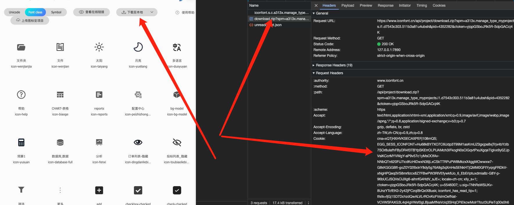

# iconfont-help
iconfont字体库下载到本地脚本

## 快速开始
1. 安装`iconfont-help`
```bash
    # 使用npm
    npm install iconfont-help -D

    # 使用yarn
    yarn add iconfont-help -D

    # 使用pnpm
    pnpm install iconfont-help -D
```
2. 在根目录新增`/tools/iconfont.js` 并输入以下内容
```js
const { download } = require("iconfont-help");

const config = {
  outputPath: "src/assets/iconfont",
  url: "要下载iconfont项目的url",
  cookie: "对应cookie"
};

download(config);
```
3. 打开[iconfont](https://www.iconfont.cn/manage/index)找到自己的项目资源，点击下载至本地出现一个链接，把他的url和cookie替换到上面配置中
4. 最后在你的全局css中或者入口文件中引入css
```js 
// 如main.js中  css路径可以在上面outputPath配置
import "@/assets/iconfont/iconfont.css";
```
5. 在终端运行脚本, 自动更新iconfont文件
```bash
    node tools/iconfont.js
```
可以在package.json文件中配置脚本script，之后可以使用`npm run font`更新字体
```json
{
    "scripts": {
        "font": "node tools/iconfont.js"
    }
}
```
## 试一试结果吧。
在组件中使用iconfont， 建议将它封成全局组件
```html
    <i class="iconfont icon的名称" />
```